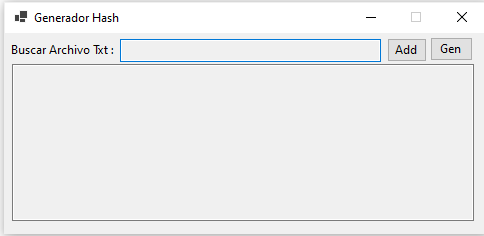

# 🔐 Generador Hash

[](https://dotnet.microsoft.com/en-us/download/dotnet/8.0)
[](LICENSE)
[](https://www.microsoft.com/windows)

> **Aplicación de escritorio para cálculo de hash SHA256 en archivos TXT, con registro de logs profesional usando Serilog.**

---

## 📝 Descripción

**GeneradorHash** es una herramienta simple y efectiva desarrollada en **C# / .NET 8 / Windows Forms**, ideal para:

- Calcular el hash SHA256 de archivos TXT generados por sistemas externos (por ejemplo, bancos o entes reguladores).
- Generar archivos de hash en el formato compatible con validadores como `sha256deep`.
- Registrar logs detallados de actividad.

Este proyecto fue realizado como ejercicio personal de aprendizaje en desarrollo de escritorio con C#, control de integridad de archivos, y buenas prácticas de logging.

---

## 🚀 Capturas de pantalla

<p align="center">
  
</p>

---

## 🔧 Tecnologías utilizadas

- C# 12
- .NET 8.0
- Windows Forms
- Serilog (logging profesional)
- Publicación self-contained (portable)

---

## 📦 Descarga

📥 [Descarga ejecutable (portable)](https://drive.google.com/file/d/1WNyD3ZJTOkID0fgfJbXELPQyzXH7ICLl/view?usp=drive_link)

_(No requiere instalación de .NET Runtime)_

---

## ⚙ Uso de la aplicación

1️⃣ Ejecuta `GeneradorHash.exe`  
2️⃣ Selecciona el archivo TXT que desees analizar  
3️⃣ Visualiza el hash SHA256 generado  
4️⃣ Genera el archivo `.sha256` con el hash y la ruta completa

---

## 🔒 ¿Por qué SHA256?

El SHA256 garantiza la integridad total del archivo transmitido, permitiendo detectar cualquier alteración accidental o maliciosa durante el envío de archivos a entidades externas.

---

## 👨‍💻 Compilación desde el código fuente

```bash
git clone https://github.com/saurom05/GeneradorHash.git
